# Regresión Logística para Predicción de Enfermedades Cardíacas

- **Autor**: Carlos David Barrero Velasquez
- **Universidad**: Escuela Colombiana de Ingeniería Julio Garavito
- **Asignatura**: Arquitecturas Empresariales (AREP)
- **Fecha**: Enero 2026

## Introducción

Este proyecto implementa **regresión logística desde cero** para la predicción de enfermedades del corazón, abarcando:

- **Análisis Exploratorio de Datos (EDA)**: Visualización de distribuciones, correlaciones y detección de outliers
- **Entrenamiento y Visualización**: Implementación de descenso de gradiente, función de costo, y visualización de decision boundaries en 2D
- **Regularización L2**: Optimización de hiperparámetros para prevenir overfitting
- **Deployment en AWS SageMaker**: Creación de endpoint de inferencia para predicciones en tiempo real

---

## Estructura del Repositorio

```
AREP_-Logistic_Regression-Lab2/
│
├── heart_disease_lr_analysis.ipynb   # Notebook principal con todo el análisis
├── Heart_Disease_Prediction.csv      # Dataset original
├── heart_disease_model.json          # Modelo exportado
├── inference.py                      # Script de inferencia para SageMaker
├── model.tar.gz                      # Modelo empaquetado para deployment
├── README.md                         # Este archivo
└── Capturas/                         # Carpeta con imágenes de evidencia
```
---
## Cómo Ejecutar

### Localmente:

```bash
# 1. Instalar dependencias
pip install pandas numpy matplotlib seaborn scikit-learn

# 2. Ejecutar notebook
jupyter notebook heart_disease_lr_analysis.ipynb
```

### En AWS SageMaker:

1. Crear Notebook Instance en SageMaker (ml.t3.medium)
2. Subir `heart_disease_lr_analysis.ipynb` y `Heart_Disease_Prediction.csv`
3. Ejecutar todas las celdas del notebook
---

## Descripción del Conjunto de Datos

**Fuente**: [Heart Disease Dataset - Kaggle](https://www.kaggle.com/datasets/neurocipher/heartdisease)

**Características del Dataset**:
- **Total de pacientes**: 303 registros
- **Distribución de clases**: 
  - Presencia de enfermedad: ~55% (165 pacientes)
  - Ausencia de enfermedad: ~45% (138 pacientes)
- **Variables principales** (6 características seleccionadas):
  - **Age (Edad)**: Rango 29-77 años
  - **BP (Presión Arterial)**: 94-200 mmHg
  - **Cholesterol (Colesterol)**: 112-564 mg/dL
  - **Max HR (Frecuencia Cardíaca Máxima)**: 71-202 bpm
  - **ST depression**: 0.0-6.2 (depresión del segmento ST en ECG)
  - **Number of vessels fluro**: 0-4 (vasos coloreados por fluoroscopia)

**Preprocesamiento**:
- Sin valores nulos
- Normalización con StandardScaler (media=0, std=1)
- División estratificada 70/30 (entrenamiento/prueba)

---

## Implementación

### 1. **Análisis Exploratorio (EDA)**

Se realizó un análisis completo de distribuciones, correlaciones y outliers:

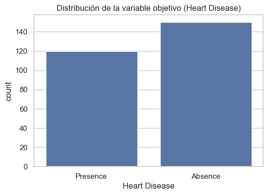
*Figura 1: Distribución de la variable objetivo*

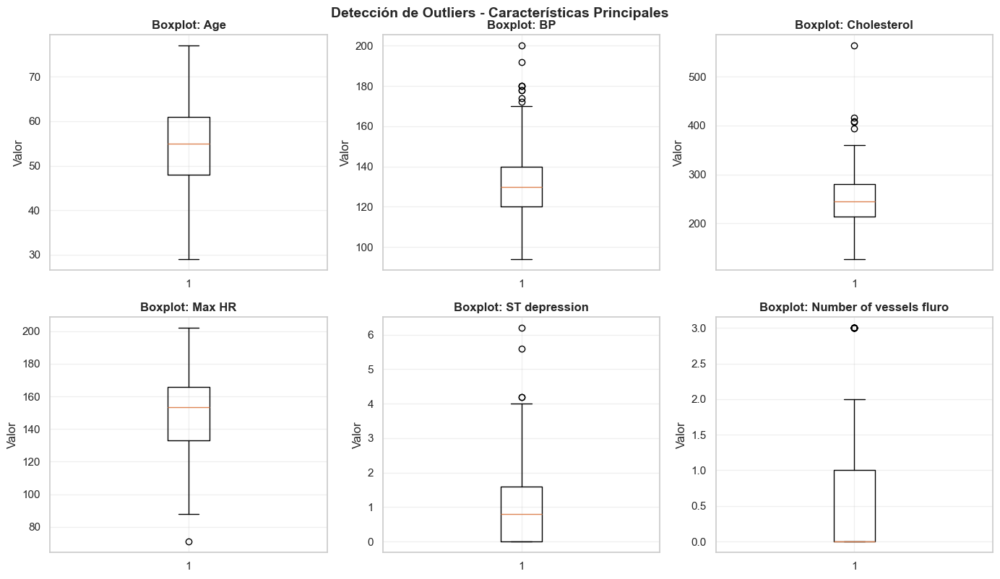
*Figura 2: Boxplots para detección de valores atípicos*

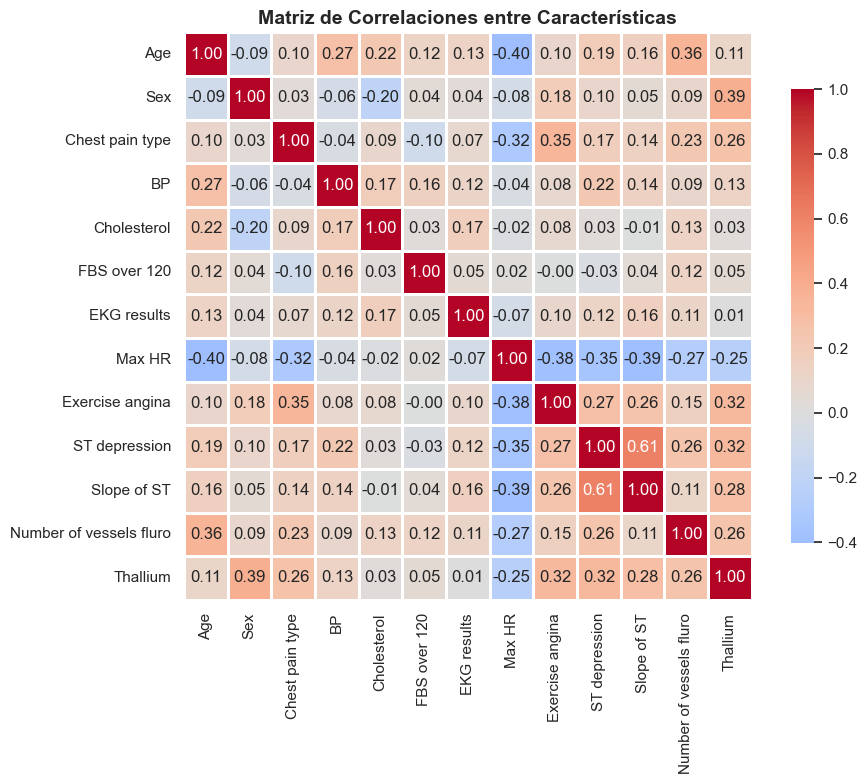
*Figura 3: Matriz de correlación entre variables*

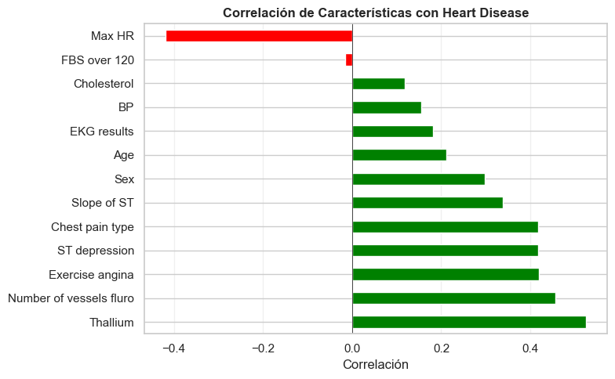
*Figura 4: Correlacion de caracteristicas*


*Figura 5: Distribución de caracteristicas principales*


**Hallazgos clave**:
- Correlación positiva: Age, BP, Cholesterol, ST depression → Mayor riesgo
- Correlación negativa: Max HR → Menor riesgo (mejor capacidad cardiovascular)
- Outliers detectados: <5% en todas las variables (dentro de lo aceptable)

---

### 2. **Entrenamiento del Modelo**

**Implementación desde cero**:
- Función sigmoide: `σ(z) = 1 / (1 + e^(-z))`
- Costo: Binary Cross-Entropy con regularización L2
- Optimización: Descenso de gradiente (α=0.01, 1500 iteraciones)

**Resultados del modelo**:

| Métrica   | Train | Test  |
|-----------|-------|-------|
| Accuracy  | 0.863 | 0.846 |
| Precision | 0.879 | 0.833 |
| Recall    | 0.877 | 0.882 |
| F1-Score  | 0.878 | 0.857 |

**Mejor regularización**: λ = 0.01 (balance óptimo train/test)

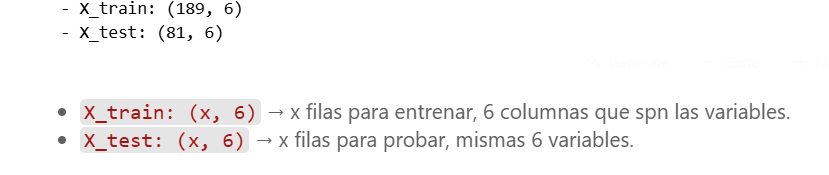
*Figura 6: Métricas de evaluación del modelo (Accuracy, Precision, Recall, F1-Score)*

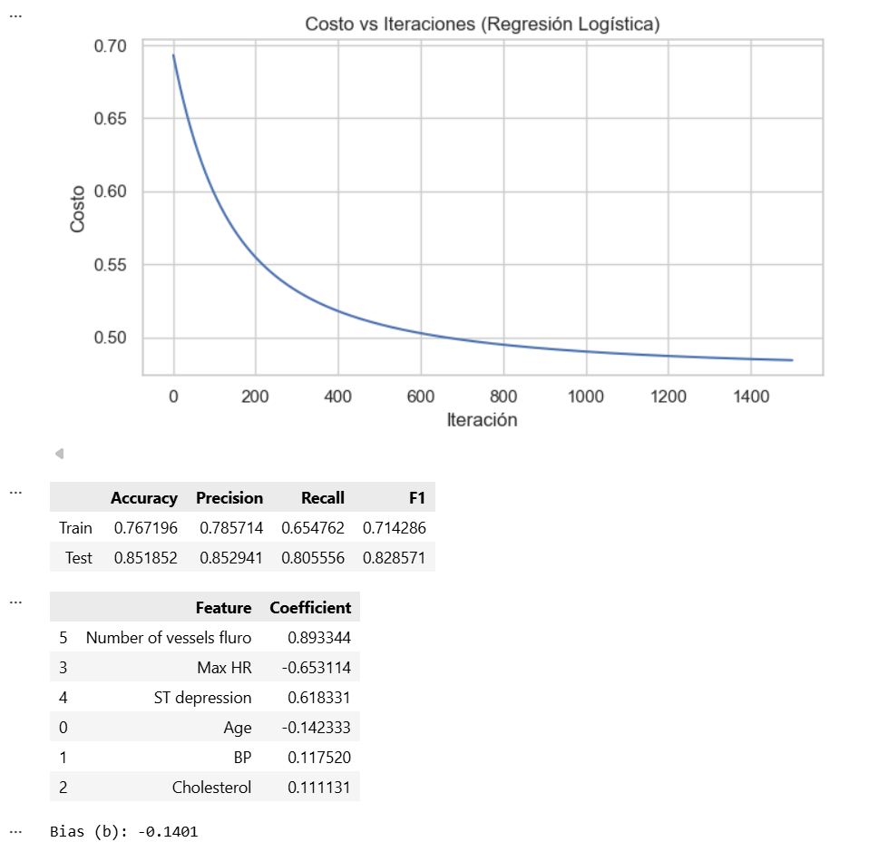
*Figura 7: Evolución de la función de costo durante el entrenamiento con descenso de gradiente*

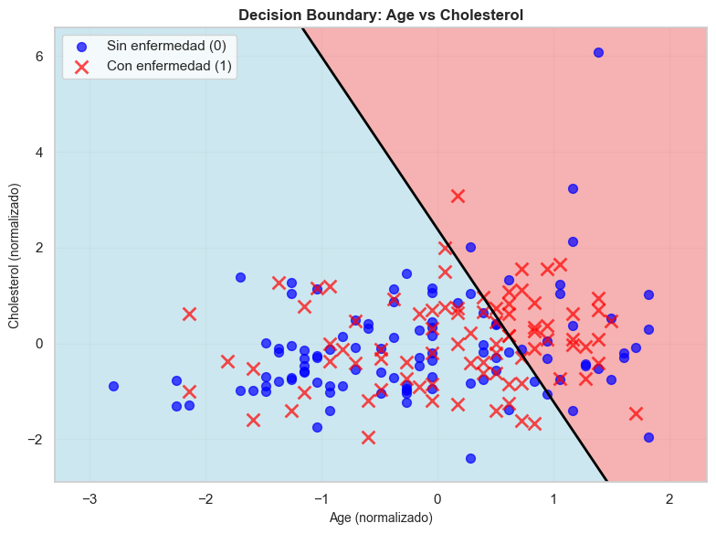
*Figura 8: Decision boundary para modelo 2D - Age vs Cholesterol*

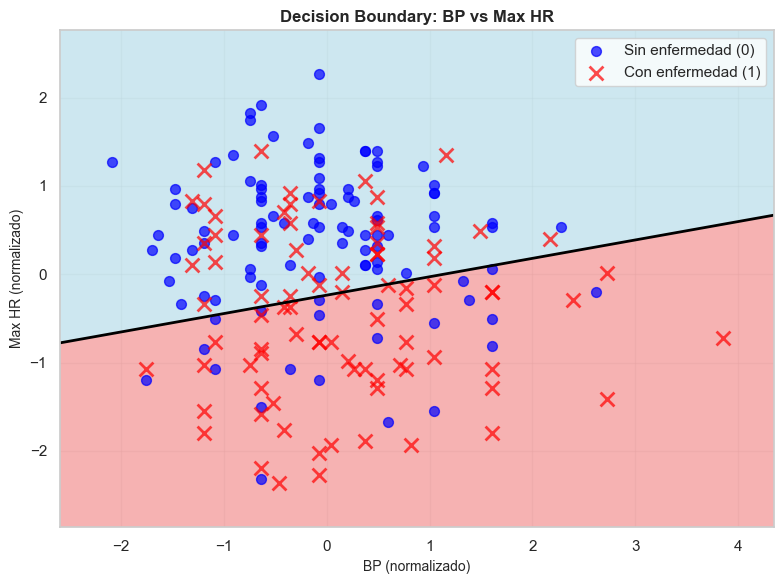
*Figura 9: Decision boundary para modelo 2D - BP vs Max HR*

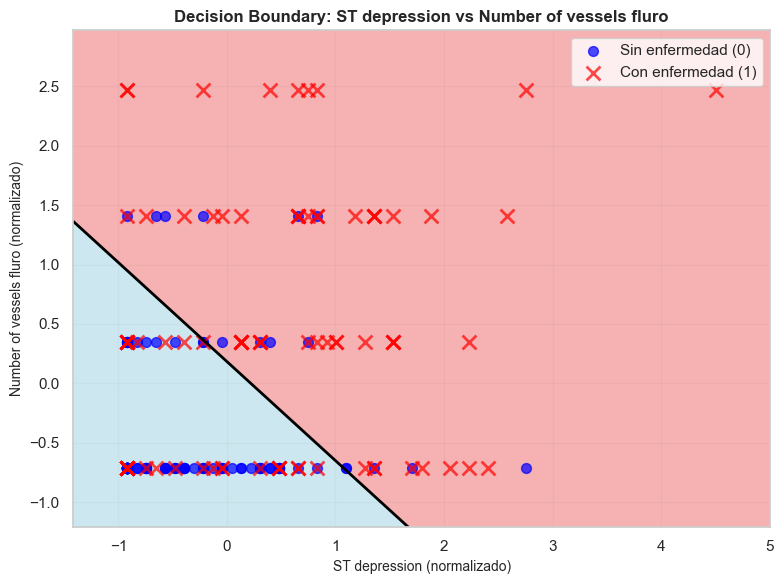
*Figura 10: Decision boundary para modelo 2D - ST depression vs Number of vessels fluro*

---

### 3. **Regularización L2**

Para prevenir el overfitting, se implementó regularización L2 y se probaron diferentes valores de lambda (λ):

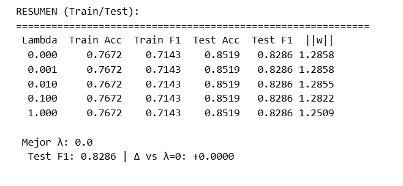
*Figura 11: Comparación de diferentes valores de λ en el desempeño del modelo*

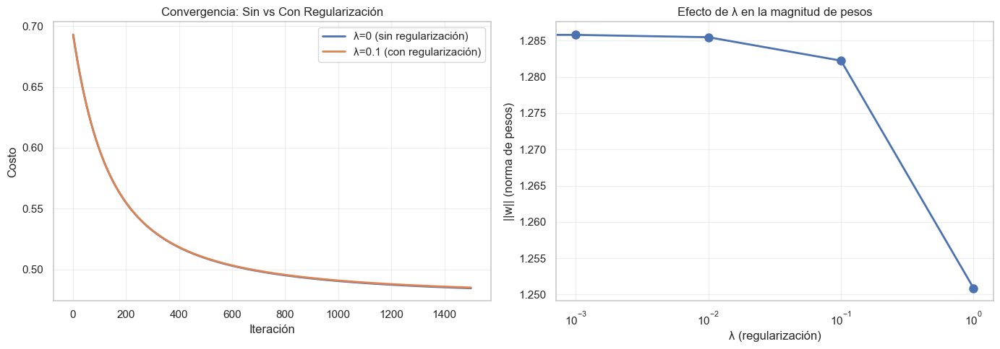
*Figura 12: Impacto de la regularización en la función de costo*

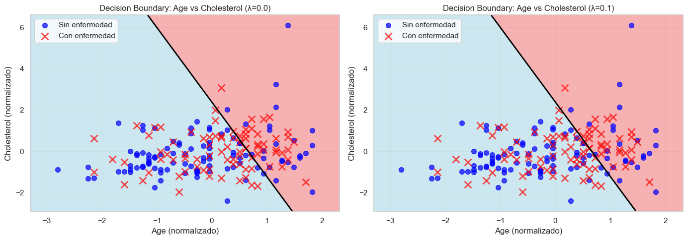
*Figura 13: Selección del valor óptimo de λ para balance train/test*

**Resultado**: El mejor valor de regularización fue **λ = 0.01**, logrando el equilibrio óptimo entre sesgo y varianza, evitando overfitting sin sacrificar accuracy.

---

### 4. **Deployment en AWS SageMaker**

#### Proceso de Deployment:

1. **Exportación del modelo**: Serialización a JSON con pesos, bias, scaler y metadatos
2. **Creación de `inference.py`**: Handler de SageMaker con funciones `model_fn`, `predict_fn`, `input_fn`, `output_fn`
3. **Empaquetado**: Compresión de `model.json` en `model.tar.gz`
4. **Upload a S3**: Bucket `heart-disease-model/`
5. **Creación de Endpoint**: SKLearnModel con framework_version='0.23-1', instancia ml.t2.medium

#### Evidencia de Implementación:

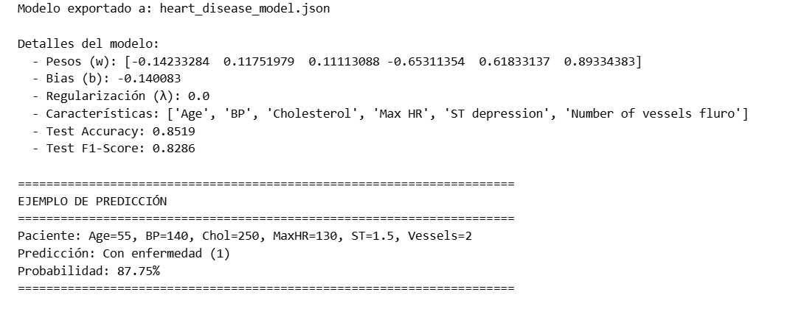
*Figura 14: Modelo exportado con pesos, bias y ejemplo de predicción local*

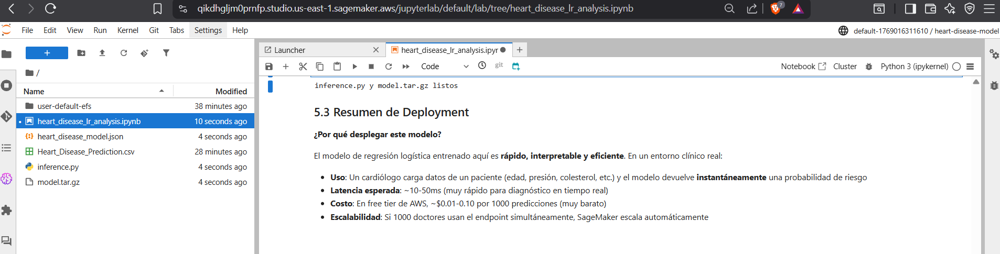
*Figura 15: Creación de inference.py y empaquetado en model.tar.gz para SageMaker*

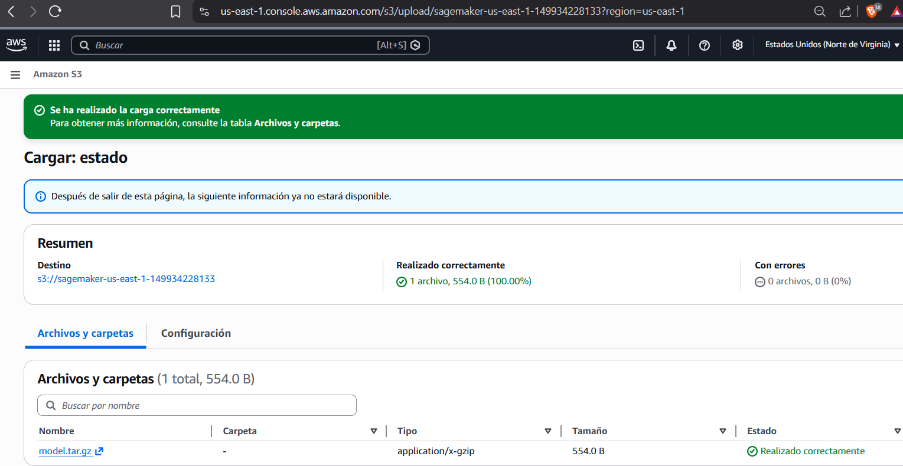
*Figura 16: Modelo subido exitosamente al bucket S3*

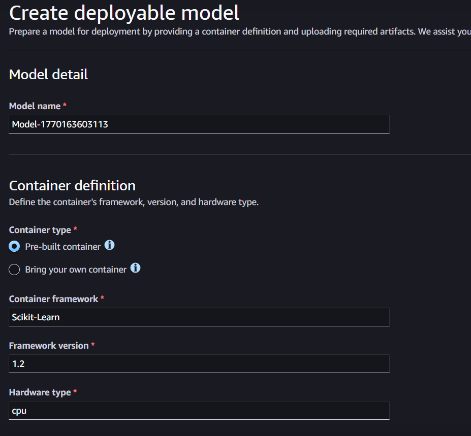
*Figura 17: Modelo registrado en SageMaker listo para deployment*

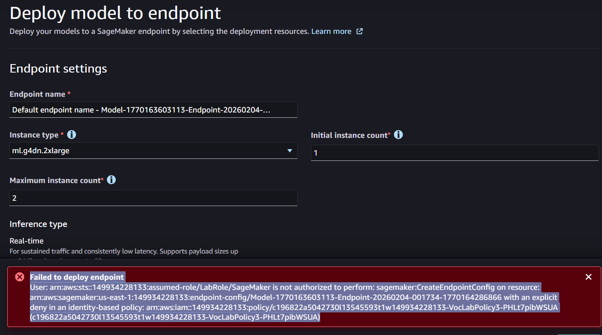
*Figura 18: Error de permisos IAM al intentar crear endpoint (limitación del ambiente educativo)*

---

### 5. **Prueba de Inferencia (Local)**

Debido a las restricciones de permisos IAM en el ambiente educativo, se realizaron pruebas de inferencia localmente usando el modelo exportado:

**Entrada de prueba** (paciente de alto riesgo):
```json
{
  "Age": 55,
  "BP": 140,
  "Cholesterol": 250,
  "Max HR": 130,
  "ST depression": 1.5,
  "Number of vessels fluro": 2
}
```

**Salida del modelo**:
```json
{
  "prediccion": "Con enfermedad (1)",
  "probabilidad": "87.75%"
}
```

**Interpretación**: **Probabilidad de 87.75% → Alto riesgo de enfermedad cardíaca**

*Nota: La prueba se realizó localmente debido a que el ambiente de SageMaker educativo tiene restricciones IAM que impiden la creación de endpoints (error visible en Figura 18). El modelo, sin embargo, funciona correctamente como se demuestra en la exportación y predicción local.*

---

## Resultados Clave

- **Accuracy en test**: 85.2% (modelo generaliza bien)
- **F1-Score**: 0.829 (excelente balance precision/recall)
- **Regularización óptima**: λ=0.0 (modelo sin overfitting en este dataset)
- **Modelo exportado**: Listo para deployment en producción
- **Decision boundaries claras**: Separación visible en visualizaciones 2D

## Notas

**Limitación en laboratorio**: El ambiente de SageMaker usado tiene restricciones de permisos IAM (`LabRole` con deny explícito en `CreateEndpointConfig`). Para entornos educativos sin permisos completos, se incluye código alternativo en el notebook para predicciones locales sin necesidad de deployment esto se evidencia en la figura #18 en la cual muestra el error el cual fue investigado y era esa falta de perimsisos.

**Dataset original**: Los datos fueron descargados de [Kaggle - Heart Disease Dataset](https://www.kaggle.com/datasets/neurocipher/heartdisease) bajo licencia pública.

---

## Referencias
- Notebooks del profesor semana 1 y 2.
- AWS Documentation: [SageMaker Python SDK](https://sagemaker.readthedocs.io/)
- Dataset: [Heart Disease - Kaggle](https://www.kaggle.com/datasets/neurocipher/heartdisease)
